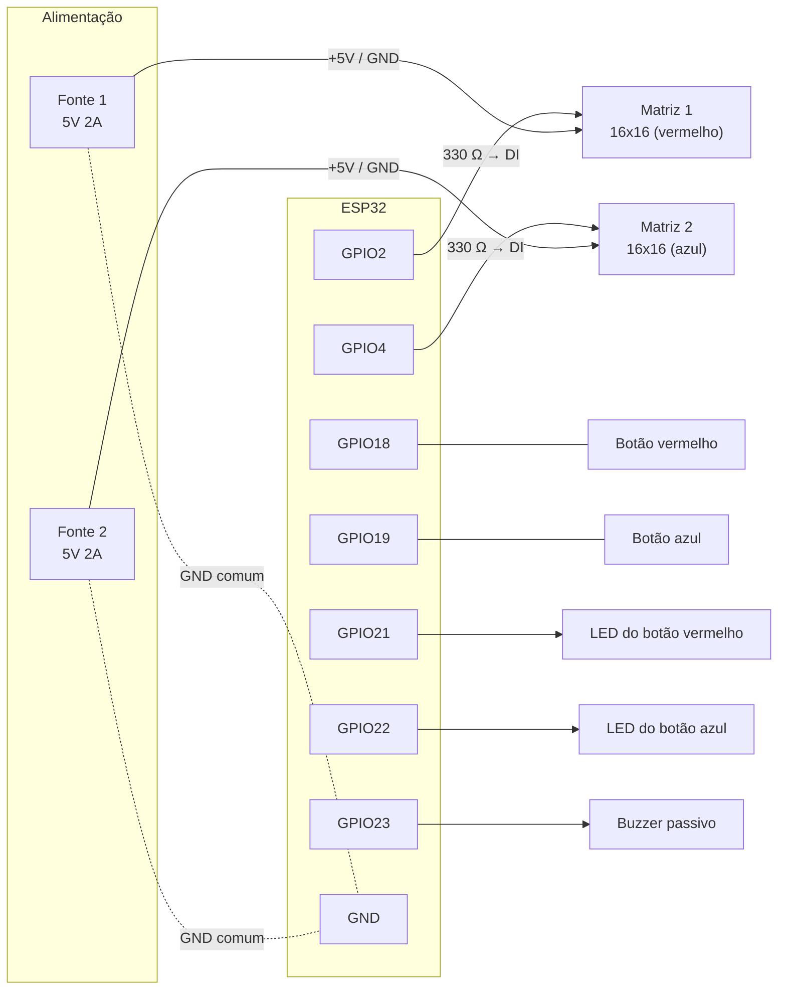

# Ligações elétricas

## Visão geral

## Tabela de pinos

| Componente | Pino do ESP32 | Outro lado |
|---|---|---|
| Matriz 1 (DI) | GPIO2 | resistor de 330 Ω em série |
| Matriz 2 (DI) | GPIO4 | resistor de 330 Ω em série |
| Botão vermelho | GPIO18 | GND (usa o pull-up interno) |
| Botão azul | GPIO19 | GND (usa o pull-up interno) |
| LED do botão vermelho (+) | GPIO21 | GND |
| LED do botão azul (+) | GPIO22 | GND |
| Buzzer passivo (+) | GPIO23 | GND |

## Alimentação

- **Fonte 1** (5V) → `+` e `–` da **matriz 1**.
- **Fonte 2** (5V) → `+` e `–` da **matriz 2**.
- O `–` das duas fontes e o **GND do ESP32** ficam **ligados juntos** (GND comum). Sem isso, o sinal de dados não tem referência e as matrizes acendem em branco ou com cores aleatórias.
- **Nunca** ligue o `+` das duas fontes entre si, nem o `+` de uma fonte no 5V do ESP32 enquanto ele estiver no USB.
- Os fios de energia das matrizes devem ser **grossos** (1 mm² ou mais), direto da fonte. Conectores pequenos e jumpers não aguentam a corrente.

## Consumo aproximado (por matriz 16x16, 256 LEDs)

| Situação | Corrente |
|---|---|
| Apagada | ~0,25 A |
| Toda vermelha ou azul, brilho 20 | ~0,65 A |
| Toda branca, brilho 20 | ~1,45 A |
| Toda branca, brilho máximo | ~15 A |

Por isso o código usa brilho baixo (`BRILHO 20`): com fontes de 2A por matriz, o jogo roda com folga.

## Observações

- O GPIO2 do ESP32 interfere na gravação. Se o upload falhar, desligue as fontes das matrizes durante a gravação ou mova a matriz 1 para outro pino (ex.: GPIO16).
- O ESP32 envia dados em 3,3V e as matrizes funcionam em 5V. Para o sinal ficar 100% confiável, dá para usar um conversor de nível 74AHCT125. O código já compensa reenviando a imagem a cada 40 ms.
- O buzzer fica mais alto com um transistor (BC548/BC337) alimentado em 5V, ou subindo `TOM_MULT` no código.
